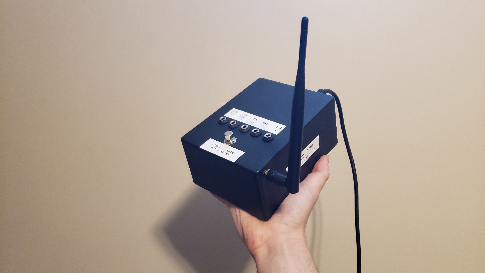
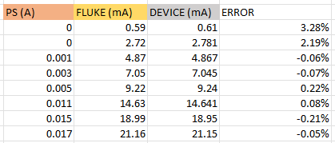

# Power-Meter Rundown

### Anthony Zhelnakov

Demo video: https://www.dropbox.com/s/2afd6wcfme4bhvw/PowerMeterDemo.mp4?dl=0

This is a DC power meter, which utilizes an ESP32 to host an access point, which a user on a browser can connect to and view real-time data from. It utilizes FreeRTOS to make use of the ESP32’s dual core architecture for reading and uploading data in parallel.

The inner 16-bit ADC chip (ADS8331), responsible for making all of the measurements, is capable of making 500k samples per second, but for the graphical data-visualisation method I am using and simplicity of the program, I found that maxing out at about 1k samples per second worked and looked just fine (the task scheduler of the ESP32 runs 1000 times a second, so I corresponded it to that).

This device was inteded to be used for analyzing realtime changes in power consumption: the user can analyze what happens during power-on/off cycles, sleep modes, different hardware modes, what happens when certain peripherals are turned on and off, which is all very helpful for diagnosing issues or just testing.

---

### Sockets:

**PS+:**
The power supply’s — which powers the unit — positive terminal’s voltage. The recommended maximum with reference to PS- is 23V. 

**PS-:**
The power supply’s negative terminal’s voltage (GND).

**Unit+:**
The positive supply terminal of the load / unit being tested.

**High Current In:**
The negative supply terminal of the load / unit being tested, IF it draws from 0 - 7.5A.

**Low Current In:**
The negative supply terminal of the load / unit being tested, IF it draws from 0 - 20mA (uses a 250mA fuse).3

---

### Instructions:

1. Connect power supply to PS+ and PS-, and connect the unit under test to UNIT+ and an appropriate CURRENT IN socket.
2. Turn on the power meter device.
3. Connect via Wi-Fi to the ESP32’s access point “Power Meter”. Password is “password”. 
4. Go to “192.168.77.77” in a browser.
5. You should be directed to the website. If the readings are nonsensically high or aren’t updating, turn off the device and go back to step 2!
6. Click the start button before considering any of the readings.
7. Turn on the power supply and unit that is being tested.
8. Measure POWER!!!
9. If the current surpasses 7.5A, the unit will be disconnected, and the reset/start button will need to be pressed again.

---

### Protection:

If the current through the HIGH input exceeds 7.5A, a relay disconnects the input from the current measurement circuit and in turn from GND. This current threshold can be adjusted with the potentiometer. Also, if the µC somehow detects this excessive current, a warning is shown on the website.

The LOW current input is protected with a 250mA fuse. Additionally, if the current exceeds 20mA through the low current input, then a warning is shown on the website. The reason being is because at higher currents, the ammeter circuit acts unpredictably and gives garbage results that shouldn’t be interpreted. If there’s a warning, it is recommended to restart the measurement, preferably with the higher current range. 
Note that this overcurrent notification method isn’t full proof, since it relies on the sampling rate of the device. If the current goes from <20mA to >20mA within the current re-sampling time, then the device will determine if there’s an overcurrent with garbage data, and possibly not display the warning.

One of the ADC inputs is connected to the HIGH current input to measure burden voltage. If this input gets connected to a large voltage, there’s a resistor and a clamping diode set up to prevent the ADC’s input from going above 5.1V. Due to the burden voltage always being below 1V, this doesn’t add any significant inaccuracies. 

---

### ADC inputs:

**Power supply voltage:**
Measures the voltage across PS+ and PS-. This is done through a voltage divider, which divides the input by 6. Due to the ADC having a reference voltage of 4.096V, the maximum input that can be measured is (4.096V x 6) = 24.576V. The absolute maximum input is (5.3V x 6) = 31.8V.

**High current measurement:**
Meant for measuring current going INTO the “High Current In” socket. This current goes through the L18P003D15 9A hall effect current sensor, who’s output also goes to a voltage divider which divides it by 3, for ADC safety.

**Low current measurement:**
Meant for measuring current going INTO the “Low Current In” socket. This current goes through an op amp circuit called a “feedback ammeter”, which itself has virtually no burden voltage. It is only effective for currents less than 20mA. The output goes directly to the ADC input.

**Offset/burden voltage:** 
Measures the voltage at the “High Current In” socket. This socket connects to an 8A power relay (used for protection), which routes the current through the hall effect current sensor, which then routes the current directly to the power supply’s ground (PS- socket). This configuration results in a ~100mOhm load. For higher currents, that results in a significant burden.
This measured burden voltage is then subtracted from the measured power supply voltage.
Note: This reveals a minor design flaw. The low current measurement circuit’s burden voltage (which mainly results from the fuse) is not measured. Though, it is almost insignificant.

---

### “Instantaneous Power”

The PS voltage, low-current, high-current, and offset/burden voltage measurements (which are utilized together to calculate “instantaneous” power) are each ~55us apart, respectively (5us PGA delay + 40us other delay).

---

### Power Supply

This device has its own power supply connected to the main 115VAC outlet. Utilizing a transformer, linear regulators and buck converter, it provides 5V and 3.3V for digital circuits, and a separate 5V, -5Va, 15Va and -15Va for analog circuits. The main reason for this is to have access to low-noise analog supply voltages, so that the output of the hall effect current sensor is clean and the ADC makes measurements as accurately as possible.

Both the power supply and the power meter PCBs utilize inductors to minimize noise on the analog line due to the digital line. The ESP32 µC sometimes requires a lot of current (upwards of 240mA), and supplying this using a linear regulator is not efficient and requires a large heatsink + constant airflow. I instead used a buck converter for this purpose, who’s output produces noise on the digital line which is “filtered” by these inductors.

---

### Accuracy

The power meter device was compared to (and calibrated with) the FLUKE 77IV Multimeter. The measurements/readings from the power supply (PS) are also listed below.

To summarize, there’s virtually always a <1% magnitude deviation from the FLUKE measurements with low current above 3mA, high current above 100mA, and voltage measurements above 300mV. See tables below for exact comparisons.

Current at 20mA range setting

Current at 7.5A range setting

Voltage (No Load)

Voltage (at UNIT+ and HIGH CURRENT IN sockets) with 1Ohm Load

---

### Voltage Burden

For the low current measurement circuit, there’s a pretty much ignorable voltage drop across it, due to the low current it's meant for.

For the high current measurement circuit however, there’s about 100mOhms from the overcurrent relay and hall effect sensor, and there’s about 45mOhms from the wires connecting the unit’s sockets to the actual power meter PCB. To give an idea on the effect this has, at 7.5A, it results in a ~1V drop across those elements. 
The ADC actually measures the burden across the relay and hall effect, but as for the wires’ burden, an estimation is calculated. These voltages are then subtracted from the measured power supply voltage to give the voltage across the sockets that the unit connects to. On top of that, there’s an option to specify resistance of the leads that connect to the unit. Using the measured current, more voltage burden is calculated and subtracted from the power supply voltage 

**It is thus imperative** for the user to look at the voltage displayed on the website to make evaluations on the unit’s power consumption, instead of using the value displayed on their power supply. 
(But the user must be careful with the custom lead resistance option as entering a high resistance will significantly drop the voltage shown on the website, providing the user with a skewed view on how much they can increase the power supply voltage — which can lead to the ADC being damaged). 

Burden voltage is also the justification for the recommended 23V PS input limit. As an example, let's say the user’s unit under test is drawing 7.5A of current. This means that the voltage across the mentioned-before elements of the measurement device is around 1V. Thus, the voltage across the unit is 1V less than the voltage from the PS. If the user applies the maximum measurable voltage, 24.5V, at the PS inputs, then the website will display 23.5V. If the user knows they can measure up to 24.5V, they might think they can increase the PS voltage after it has already oversaturated the ADC input, which will lend inaccurate results. 
So, for the device to be reliable in this edge case, it is recommended to apply a maximum voltage of 23V at the unit’s terminals.

---